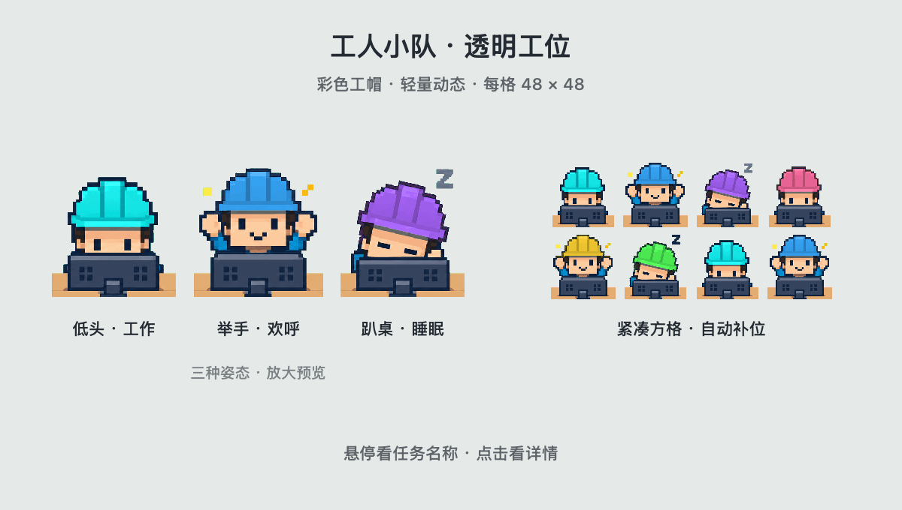

# Codex Workers

[简体中文](README.md)

A Codex plugin for Codexholics who keep several tasks running at once. Each active task becomes a tiny pixel worker on your desktop, so you can see who's working and who's finished at a glance.



## Get started

Requires macOS 13+, the Codex desktop app, Xcode Command Line Tools and `/usr/bin/python3`. Run `xcode-select --install` if you need the build tools.

Download the repository, then run from its directory:

```sh
bash scripts/build.sh
open "dist/Codex Workers.app"
```

Start a local task in Codex. A worker usually appears within about two seconds. Quit any existing copy through its menu before opening a new build.

## Controls

Hover to see a task name, click for details, and drag to move the squad. Right-click a worker or use the menu bar to change size, adjust the inactivity timeout, or hide the group.

With no active tasks, only the menu bar icon remains. Workers stay while their tasks are running; each inactivity timer is independent.

[Installation & troubleshooting](docs/troubleshooting.md) · [Development](CONTRIBUTING.md) · [Privacy](docs/privacy.md)
