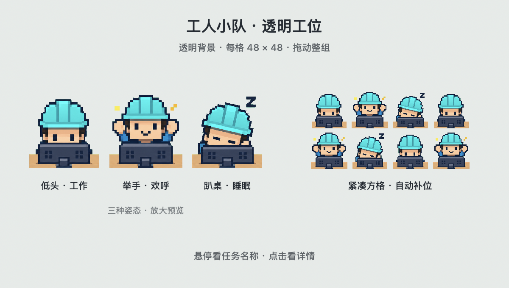

# Codex Workers

**A tiny pixel worker for every active Codex task on your Mac.**

Keep an eye on several tasks without switching between their windows. Workers look down while working, cheer when a turn finishes, and sleep while idle. They share one compact, transparent desktop window and leave after their individual inactivity timeout.

[简体中文](README.md) · [Architecture](docs/architecture.md) · [Privacy](docs/privacy.md) · [Troubleshooting](docs/troubleshooting.md) · [Development](CONTRIBUTING.md)



The preview uses synthetic tasks rendered by the app itself. The floating window has a transparent background; the three poses on the left are enlarged.

## Features

- One worker per observed active local task. Historical idle tasks never join the squad.
- A single floating AppKit panel with adjoining square cells, 48 × 48 points by default. Drag any worker to move the whole group.
- Three transparent pixel-art poses: working, cheering and sleeping.
- Independent inactivity timers, with automatic grid reflow when workers leave.
- Menu bar controls, multiple desktop support and optional launch at login.
- Local processing with Python's standard library. No runtime network requests, model calls or telemetry.

This is an independent project, not an official OpenAI product. The app's interface and detailed documentation are currently in Chinese. The adapter depends on internal Codex file formats, not a stable public API.

## Quick start

Requirements: **macOS 13+**, Xcode Command Line Tools or Xcode, a working `/usr/bin/python3`, and the Codex desktop app. No third-party runtime dependencies are needed.

Install Apple's command line tools if necessary:

```sh
xcode-select --install
```

Download or clone this repository, then run from its root:

```sh
bash scripts/build.sh
open "dist/Codex Workers.app"
```

A two-person icon appears in the menu bar. Start a local task in Codex to see a worker, usually within the next two-second poll. Large history files may take longer to scan initially. Quit an existing copy through its menu before opening a new build; the app runs as a single instance.

### Install for everyday use

Quit the running app, then copy the build to the current user's Applications directory:

```sh
mkdir -p "$HOME/Applications"
ditto "dist/Codex Workers.app" "$HOME/Applications/Codex Workers.app"
open "$HOME/Applications/Codex Workers.app"
```

The menu's launch-at-login option requires this installation location. It does not forcibly restart an app you have quit.

`bash scripts/launch.sh` opens the installed copy first, falling back to the repository's build. Use the explicit build commands above when developing.

## States and controls

| State | Appearance |
| --- | --- |
| Working | Looking down at the computer |
| Just completed | Hands raised in celebration |
| Idle or interrupted | Sleeping, with a small Z |
| Approval request | Working pose with an amber marker; requires optional Hooks |
| Failed | Working pose with a red marker |
| Disconnected or unknown | Faded working pose |

Completion is shown for approximately 90 seconds, then changes to sleep. A worker may leave sooner if its TTL expires. These are static poses that change with task state.

TTL is measured from the **last confirmed activity**, not task creation. The default is five minutes. Each active observation renews only that worker's timer, so long-running tasks stay visible. Restarting the app does not restore old idle workers.

Drag any worker to move the squad, hover to see its task, or click for details. Right-click a worker or use the menu bar to choose cell sizes of 40 / 48 / 56 / 64 points and TTLs of 1 / 3 / 5 / 10 / 30 minutes. The grid normally uses up to four columns and adapts to screen space. With no workers, only the menu bar icon remains.

The details button opens Codex itself. It does not navigate directly to a specific task; a separate button copies the task name for lookup.

## Local data

A Python child process combines read-only SQLite metadata, existing writer locks and lifecycle events from the current task record. It sends JSON snapshots to the native app through a local pipe every two seconds.

The adapter uses task IDs, display names, project paths, turn states and timestamps. It scans record bytes to locate lifecycle prefixes but does not parse or retain message bodies, tool arguments or reasoning. Optional Hooks retain only allowed event metadata. It does not open credential files.

App-owned settings and count-only diagnostics live in `~/.codex-workers/`. Window placement and cell size use macOS preferences. All artwork is bundled. See [Privacy](docs/privacy.md) for the exact boundaries, including the distinction between scanning bytes and parsing content.

## Optional plugin

The repository is also a Codex plugin root, with a manifest, a launch/diagnostic skill and optional Hooks. The desktop app works without plugin installation or Hooks. Downloading the repository alone does not install the plugin; see [Plugin notes](docs/plugin.md).

## Development

```sh
/usr/bin/python3 -m unittest discover -s tests -v
bash scripts/check.sh
```

The full check builds the app, verifies its signature and runs native window tests using synthetic tasks. It requires a logged-in macOS graphical session and briefly shows test workers. See [CONTRIBUTING.md](CONTRIBUTING.md) for details.

## Limitations

- Supports local desktop tasks with the expected SQLite databases and writer locks. Cloud tasks, remote hosts and legacy CLI formats are not supported.
- Codex internal schema changes may require adapter updates. Read failures are shown as errors and do not renew workers' timers.
- Local builds target the build machine's CPU architecture. They are ad-hoc signed, not Developer ID signed or notarized.
- An open-source license has not been selected yet.
