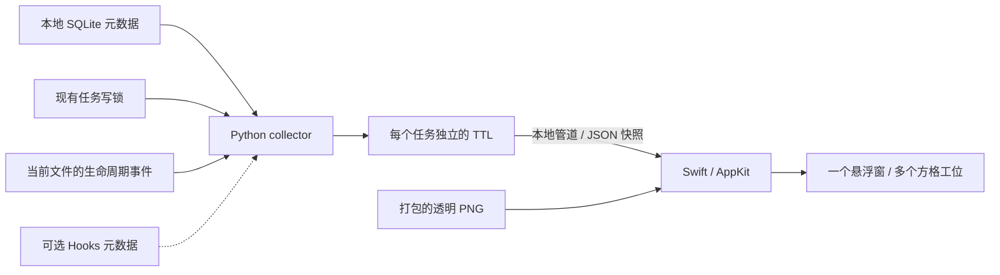

# 架构

[返回 README](../README.md)

项目由一个原生桌面进程、一个本地状态读取子进程，以及可选的 Codex 插件组成。显示层不直接查询 Codex 数据库；它接收读取器生成的快照。



## 1. 本地状态适配器

[`scripts/collector.py`](../scripts/collector.py) 每 2 秒扫描一次。它按文件名的数字版本选择 `state_*.sqlite` 和 `thread_history_*.sqlite`，以 `mode=ro` 打开连接，并开启 `PRAGMA query_only=ON`。

查询依赖的字段包括：

| 来源 | 用途 |
| --- | --- |
| `state: threads` | `id`、`cwd`、`updated_at`、`source`、`archived`；存在时读取 `name`、`rollout_path`、`thread_source` |
| `thread_history: thread_turns` | `thread_id`、`turn_id`、`status`、`started_at`、`completed_at`、`rollout_ordinal` |
| `thread-writer-locks/*.lock` | 判断本机进程是否仍持有任务写锁 |

这些是**当前适配器依赖的内部结构**，不是完整数据库文档或稳定接口承诺。缺少显示名称时使用「未命名会话」，不回退到可能包含完整首条提示词的旧 `title` 字段。

扫描对象为近期更新或仍被本机持有的、未归档的用户主任务。内部子任务会被过滤。仅有 `inProgress` 数据库状态不够：还需要检测到现有写锁被持有，才标记为活跃。锁检测使用只读打开和非阻塞锁探测，不创建或改写 Codex 的锁文件。

## 2. 修正滞后的轮次状态

恢复任务后，历史数据库可能暂时仍记录上一轮的 `interrupted`。因此 [`scripts/lifecycle.py`](../scripts/lifecycle.py) 跟随当前 `rollout_path`，从顶层生命周期事件前缀中提取时间、轮次 ID 和开始／完成／中断状态。

- 仅接受位于 Codex `sessions/` 或 `archived_sessions/` 下的实际路径。
- 增量保存文件身份和读取位置；换文件、替换文件或截断后重新建立位置。
- 非生命周期正文按块跳过；未写完整的行留到下次轮询处理。
- 冷启动按预算分批追赶，尚未追完的文件不提供旧事件作为当前状态。
- 同一轮次已有数据库终态时优先保留终态，避免丢失失败状态；较新的事件可修正旧轮次投影。

字节扫描和内容解析的边界见 [隐私说明](privacy.md)。

## 3. 每个工人的生命周期

`Roster` 只存在于读取器内存中，按任务 ID 保存成员：

```text
首次确认活跃 → 加入小队
再次确认活跃 → 更新 lastActive
完成 / 暂停 / 失败 / 断连 → 停止续期
now >= lastActive + TTL → 离场
```

修改 TTL 时用最后活跃时间重新计算截止时间。读取失败、重复轮询空闲记录、旧 Hook 事件都不能续期。重启读取器后从空队列开始，因此不会恢复旧的空闲工人。

读取器输出换行分隔的 JSON，通过标准输出管道交给原生进程；快照包含工人元数据、状态、截止时间、扫描时间和错误标记。它不是网络服务。

## 4. 原生窗口与素材

[`native/Workers.swift`](../native/Workers.swift) 使用一个透明、无边框、非激活的 `NSPanel`。每个工人是同一面板中的子视图，默认占 48 × 48 点；全部拖动操作共享同一个窗口位置。

`WorkerGrid` 按加入顺序排布，成员离场后补位，并依据屏幕空间调整行列。窗口位置和格子大小保存在本机偏好设置中。

`WorkerArtwork` 从应用包加载三张 PNG，缓存后按像素插值方式缩放绘制，保留透明度。`WorkerPose` 将状态映射为工作、欢呼和睡眠；审批、失败和断连以小标记或透明度补充表达。

原生层还会在读取器更新停止时将状态降为未知，并按已有截止时间清理工人。菜单提供重连入口。

## 5. 可选集成

- [`hooks/hooks.json`](../hooks/hooks.json) 调用 [`scripts/hook.py`](../scripts/hook.py)，只把允许的事件元数据写入小队数据目录。Hooks 不返回审批决定。
- [`skills/workers/SKILL.md`](../skills/workers/SKILL.md) 定义从 Codex 启动和诊断应用的操作。
- [`scripts/login_startup.py`](../scripts/login_startup.py) 管理当前用户的登录 LaunchAgent，使用 `RunAtLoad=true`、`KeepAlive=false`，不会在用户退出应用后反复拉起它。

## 源码布局

```text
.codex-plugin/plugin.json   插件清单
assets/preview.png          合成任务预览
assets/workers/             三种透明工位素材
docs/                      架构、隐私、排障和插件说明
hooks/hooks.json           可选事件配置
native/Workers.swift       窗口、状态展示、菜单和原生测试
native/Info.plist           macOS 应用元数据
scripts/build.sh           构建并进行本地签名
scripts/check.sh           本地完整检查
scripts/launch.sh          优先启动已安装的应用
scripts/collector.py       数据适配器和 TTL 队列
scripts/lifecycle.py       生命周期前缀读取与状态合并
scripts/hook.py            可选 Hook 记录器
scripts/login_startup.py   登录启动管理
skills/workers/            Codex 技能
tests/test_workers.py      基于临时数据的 Python 测试
```
